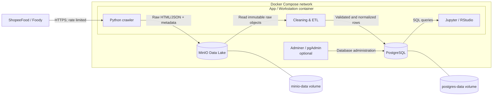

# Tutorial Report 1 – Proposal & Docker Architecture

Tài liệu này hướng dẫn nhóm hoàn thành **Report 1 (10%)** trong tuần 1–2 cho đề tài **Phân tích cảm xúc review ẩm thực** thuộc Chủ đề 2 của môn ADY201m.

Report 1 cần chứng minh hai điều:

1. Nhóm đã xác định được câu hỏi nghiên cứu có thể kiểm chứng bằng dữ liệu.
2. Nhóm đã thiết kế được hệ thống có khả năng thu thập và xử lý dữ liệu để kiểm định câu hỏi đó.

Ở tuần 1–2, nhóm **chưa cần** hoàn thiện crawler, MinIO, PostgreSQL hay mô hình Machine Learning. Tuy nhiên, proposal phải đủ cụ thể để sang tuần 3–4 có thể triển khai mà không phải thay đổi toàn bộ bài toán.

## 1. Report 1 cần nộp những gì?

Theo yêu cầu môn học, Report 1 gồm ba phần bắt buộc:

- **Research Proposal:** bài toán, câu hỏi nghiên cứu và giả thuyết `H0/H1`.
- **GitHub Repository:** repository được tổ chức theo cấu trúc chuẩn của đề bài.
- **Docker Architecture:** sơ đồ các container, luồng dữ liệu, network và nơi lưu trữ dữ liệu.

Nhóm nên kèm thêm phạm vi crawl, các trường dữ liệu cần thu thập, thiết kế bảng sơ bộ, rủi ro và kế hoạch tuần 3–4. Những nội dung này giúp chứng minh kiến trúc thực sự phục vụ giả thuyết nghiên cứu.

## 2. Giả thuyết nghiên cứu là gì?

Giả thuyết nghiên cứu là một nhận định có thể được kiểm chứng hoặc bác bỏ bằng dữ liệu.

- **H0 – giả thuyết không:** không có khác biệt, không có mối liên hệ hoặc mô hình mới không cải thiện so với baseline.
- **H1 – giả thuyết đối:** có khác biệt, có mối liên hệ hoặc mô hình mới có cải thiện so với baseline.

Một giả thuyết tốt cần chỉ rõ:

- đối tượng và đơn vị quan sát;
- biến độc lập hoặc đặc trưng đầu vào `X`;
- biến phụ thuộc hoặc nhãn cần dự đoán `Y`;
- phạm vi dữ liệu;
- cách đo lường các biến;
- phương pháp kiểm định dự kiến;
- tiêu chí dùng để bác bỏ `H0`.

Không nên viết quá chung:

> Nội dung bình luận có ảnh hưởng đến đánh giá của khách hàng.

Nên chuyển thành một câu có thể đo được:

> Đặc trưng TF-IDF trích xuất từ nội dung bình luận giúp nhận diện review 1 sao tốt hơn mô hình baseline chỉ sử dụng metadata.

Trong báo cáo thống kê, cách diễn đạt chính xác là **“bác bỏ H0”** hoặc **“chưa đủ bằng chứng để bác bỏ H0”**. Không nên kết luận rằng H0 chắc chắn đúng chỉ vì `p-value` lớn hơn ngưỡng ý nghĩa.

## 3. Nhóm nên nghiên cứu giả thuyết nào?

Đề bài Chủ đề 2 đưa ra ba hướng:

1. Rating có giảm khi quán có nhiều review hơn không?
2. Từ khóa nào có tính quyết định đối với review 1 sao (`fatal keywords`)?
3. Cách đánh giá có khác nhau theo vùng hoặc theo độ dài bình luận không?

Nhóm chỉ nên chọn **một giả thuyết chính** và tối đa một hoặc hai giả thuyết phụ. Với tên đề tài Sentiment Analysis, giả thuyết về nội dung review và đánh giá 1 sao phù hợp nhất để làm hướng chính.

### 3.1. Giả thuyết chính – nội dung review và đánh giá 1 sao

**Câu hỏi nghiên cứu:** Nội dung bình luận có giúp nhận diện review 1 sao tốt hơn việc chỉ sử dụng metadata không?

- **H0A:** Đặc trưng văn bản của bình luận không cải thiện đáng kể khả năng nhận diện review 1 sao so với mô hình baseline không dùng nội dung văn bản.
- **H1A:** Đặc trưng văn bản cải thiện đáng kể khả năng nhận diện review 1 sao; một số từ hoặc cụm từ có sức dự báo nổi bật và ổn định.

| Thành phần | Thiết kế đề xuất |
|---|---|
| Đơn vị quan sát | Một review |
| Biến mục tiêu `Y` | `is_one_star = 1` nếu rating bằng 1, ngược lại bằng 0 |
| Baseline `X` | Độ dài bình luận, khu vực, loại món, phân khúc giá |
| Đặc trưng văn bản | TF-IDF unigram/bigram từ nội dung review đã làm sạch |
| Model 1 | Logistic Regression |
| Model 2 | Linear SVM hoặc mô hình khác được nhóm giải thích |
| Metric chính | F1-score hoặc PR-AUC cho lớp 1 sao |
| Metric bổ sung | Precision, Recall, confusion matrix |
| Cách kiểm định | Cross-validation hoặc bootstrap trên cùng các fold; so sánh baseline với mô hình có văn bản |

Nhóm phải định nghĩa trước “cải thiện đáng kể”. Ví dụ: mô hình văn bản có F1 cao hơn baseline và chênh lệch ổn định qua các fold. Nếu dùng kiểm định thống kê, có thể chọn mức ý nghĩa `α = 0.05`; nếu dùng thêm ngưỡng cải thiện thực tiễn, phải công bố ngưỡng đó trước khi chạy mô hình.

`Fatal keywords` nên được diễn giải là các từ/cụm từ có **sức dự báo mạnh và ổn định**, chẳng hạn dựa trên hệ số của Logistic Regression qua nhiều fold. Không được mặc nhiên kết luận các từ đó là nguyên nhân khiến khách hàng chấm 1 sao.

### 3.2. Giả thuyết phụ – số lượng review và rating

**Câu hỏi nghiên cứu:** Quán có nhiều review hơn có xu hướng nhận rating trung bình thấp hơn không?

- **H0B:** Sau khi kiểm soát khu vực, loại món và phân khúc giá, số lượng review không có mối liên hệ có ý nghĩa thống kê với rating trung bình của quán.
- **H1B:** Sau khi kiểm soát các yếu tố trên, số lượng review có mối liên hệ âm có ý nghĩa thống kê với rating trung bình của quán.

| Thành phần | Thiết kế đề xuất |
|---|---|
| Đơn vị quan sát | Một quán tại một thời điểm crawl |
| Biến độc lập `X` | `review_count` hoặc `log1p(review_count)` |
| Biến phụ thuộc `Y` | `average_rating` |
| Biến kiểm soát | Thành phố/quận, loại món, phân khúc giá, nguồn dữ liệu |
| Phân tích ban đầu | Scatter plot và Spearman correlation |
| Phương pháp chính | Hồi quy có biến kiểm soát; kiểm tra phi tuyến nếu cần |
| Tiêu chí thống kê | Dấu của hệ số, effect size, khoảng tin cậy và `p-value` |

Lưu ý: `review_count` chỉ là biến đại diện cho **mức độ phổ biến**, không đo trực tiếp độ đông khách. Dữ liệu chụp tại một thời điểm chỉ cho phép phân tích mối liên hệ giữa các quán, không chứng minh rằng “quán trở nên đông hơn làm chất lượng giảm”. Muốn nghiên cứu sự thay đổi theo thời gian, nhóm cần crawl lặp lại các snapshot và theo dõi biến động của `review_count` cùng `average_rating`.

### 3.3. Giả thuyết phụ tùy chọn – vùng miền hoặc độ dài bình luận

Chỉ thêm giả thuyết này khi dữ liệu pilot cho thấy mỗi vùng có đủ số lượng review và cách xác định vùng rõ ràng.

Ví dụ về độ dài bình luận:

- **H0C:** Phân phối độ dài bình luận không khác biệt giữa các nhóm rating.
- **H1C:** Có ít nhất một nhóm rating có phân phối độ dài bình luận khác biệt.

Phương pháp dự kiến có thể là ANOVA nếu các giả định phù hợp hoặc Kruskal–Wallis nếu dữ liệu lệch và nhiều ngoại lệ. Nếu phân tích Bắc/Nam, nhóm phải công bố quy tắc ánh xạ địa lý và kiểm soát sự mất cân bằng số mẫu giữa các vùng.

## 4. Bảng ánh xạ giả thuyết với dữ liệu cần crawl

Mỗi field được crawl phải phục vụ ít nhất một mục tiêu nghiên cứu, kiểm soát chất lượng hoặc truy xuất nguồn gốc.

| Giả thuyết/mục đích | Field tối thiểu | Mức dữ liệu |
|---|---|---|
| Nhận diện review 1 sao | `review_id`, `review_text`, `rating` | Review |
| Baseline và EDA | `review_time`, `restaurant_id`, `city`, `district`, `cuisine_type`, `price_range` | Review/quán |
| Review count và rating | `review_count`, `average_rating`, `crawled_at` | Snapshot của quán |
| Chống trùng và truy xuất raw | `source`, `source_url`, `content_hash`, `raw_object_path`, `crawl_run_id` | Kỹ thuật |
| Theo dõi lỗi crawl | `http_status`, `error_type`, `attempted_at` | Crawl run |

Nếu nguồn không cung cấp ổn định một field quan trọng, nhóm cần điều chỉnh giả thuyết hoặc chọn nguồn khác ngay sau pilot. Không nên chờ đến Report 3 mới phát hiện dữ liệu không đủ để kiểm định.

## 5. Phạm vi nghiên cứu cần chốt trong tuần 1–2

Report 1 phải trả lời được:

- Crawl ShopeeFood hay Foody? Nguồn nào là nguồn chính?
- Thu thập tại thành phố, quận/huyện hoặc nhóm loại món nào?
- Đơn vị quan sát là review, quán hay snapshot của quán?
- Quy mô mẫu mục tiêu là bao nhiêu quán và bao nhiêu review?
- Crawl một lần hay nhiều lần theo thời gian?
- Mỗi giả thuyết cần những trường dữ liệu nào?
- Review 1 sao có đủ mẫu để huấn luyện và đánh giá không?
- Nguồn có quy định gì về `robots.txt`, rate limit, điều khoản sử dụng và dữ liệu cá nhân?

### Ví dụ phạm vi để thảo luận sau pilot

> **Nguồn chính:** chọn một trong ShopeeFood hoặc Foody sau khi kiểm tra khả năng thu thập hợp lệ.
>
> **Địa bàn:** một thành phố; có thể giới hạn 3–5 quận để kiểm soát phạm vi.
>
> **Quy mô ban đầu:** pilot 20–30 quán để xác nhận schema; quy mô chính thức được quyết định từ tỷ lệ review 1 sao và tốc độ crawl thực tế.
>
> **Tần suất:** một lần nếu tập trung vào phân loại văn bản; nhiều snapshot nếu giữ giả thuyết thay đổi rating theo mức độ phổ biến.
>
> **Dữ liệu:** nội dung review, rating, thời gian review, thông tin quán, số review, rating trung bình, URL nguồn và thời điểm crawl.

Các con số trên chỉ là ví dụ lập kế hoạch, không phải cam kết cuối cùng. Nhóm nên chạy pilot nhỏ trước, sau đó ghi trong Report 1 cách ước lượng quy mô dựa trên tỷ lệ lớp 1 sao, giới hạn thời gian và tài nguyên.

## 6. Sơ đồ kiến trúc Docker là gì?

Sơ đồ kiến trúc Docker không phải là cây thư mục repository. Đây là sơ đồ mô tả:

- hệ thống gồm những service/container nào;
- container nào giao tiếp với container nào;
- dữ liệu đi theo hướng nào;
- dữ liệu raw và processed được lưu ở đâu;
- port nào được mở để người dùng truy cập;
- network và persistent volume nào được sử dụng.

Kiến trúc tối thiểu theo đề bài gồm:

1. **MinIO container:** Data Lake lưu file raw.
2. **PostgreSQL container:** database lưu dữ liệu đã làm sạch.
3. **App/Workstation container:** chạy Python crawler, ETL và môi trường phân tích Jupyter/RStudio.

Adminer hoặc pgAdmin có thể được thêm để hỗ trợ chạy SQL trực quan, nhưng đây là service phụ, không phải thành phần bắt buộc.

## 7. Sơ đồ kiến trúc đề xuất



Luồng chính cần được trình bày rõ trong Report 1:

```text
Crawl -> MinIO/Raw -> Processing -> PostgreSQL/Processed -> EDA/Modeling
```

Không nên cho crawler ghi trực tiếp dữ liệu đã làm sạch vào PostgreSQL rồi bỏ qua MinIO, vì workflow bắt buộc của môn học yêu cầu giữ dữ liệu raw trong Data Lake trước khi xử lý.

## 8. Vai trò cụ thể của từng container

### 8.1. App/Workstation

Container này có thể chứa nhiều module trong cùng một image ở giai đoạn đầu:

- gửi request đến nguồn dữ liệu theo rate limit;
- retry có giới hạn và ghi log khi request lỗi;
- lưu HTML/JSON nguyên bản vào MinIO;
- đọc raw object từ MinIO để validate, loại trùng và chuẩn hóa;
- ghi dữ liệu processed vào PostgreSQL;
- chạy notebook/RStudio cho EDA và modeling.

Khi dự án lớn hơn, cùng một image có thể chạy thành các service riêng như `crawler`, `processor` và `analysis`. Report 1 chỉ cần chọn một thiết kế và giải thích lý do.

### 8.2. MinIO

MinIO lưu dữ liệu raw chưa chỉnh sửa để nhóm có thể tái xử lý mà không phải crawl lại.

Ví dụ bucket và object path:

```text
raw-data/
└── foody/
    └── 2026-09-08/
        └── restaurant-123/
            └── review-page-001.json
```

Object nên kèm metadata như nguồn, URL, thời điểm crawl, HTTP status và content hash. Không sửa trực tiếp raw object sau khi đã lưu; nếu crawl lại, tạo object/version mới.

### 8.3. PostgreSQL

PostgreSQL lưu dữ liệu dạng bảng sau khi đã kiểm tra và chuẩn hóa, phục vụ SQL, EDA và modeling.

Các bảng sơ bộ:

- `crawl_runs`: một lần chạy crawler, trạng thái và thống kê thành công/thất bại;
- `raw_documents`: metadata và đường dẫn đến object trong MinIO;
- `restaurants`: thông tin tương đối ổn định của quán;
- `restaurant_snapshots`: rating trung bình và số review tại từng thời điểm crawl;
- `reviews`: nội dung review, rating và thời điểm review;
- `crawl_errors`: lỗi request hoặc parse cần điều tra.

Ví dụ quan hệ giữa PostgreSQL và MinIO:

```text
raw_documents
├── raw_document_id
├── crawl_run_id
├── source
├── source_url
├── object_path
├── content_hash
├── http_status
└── crawled_at
```

`object_path` trỏ đến file raw tương ứng trong MinIO. Nhờ đó, một dòng processed luôn có thể được truy xuất ngược về dữ liệu gốc.

### 8.4. Adminer/pgAdmin – tùy chọn

Service này hỗ trợ:

- xem schema và bảng PostgreSQL;
- chạy SQL kiểm tra chất lượng dữ liệu;
- quan sát kết quả ETL trong lúc phát triển.

Không nên xem Adminer/pgAdmin là nơi lưu dữ liệu. Đây chỉ là giao diện quản trị PostgreSQL và có thể tắt ngoài môi trường phát triển.

## 9. Phân biệt MinIO và PostgreSQL

| MinIO | PostgreSQL |
|---|---|
| Lưu file raw | Lưu dữ liệu processed dạng bảng |
| HTML, JSON và response gốc | Review, rating, thông tin quán, timestamp |
| Giữ bằng chứng nguồn và khả năng tái xử lý | Hỗ trợ SQL, join, validation và phân tích |
| Tổ chức bằng bucket/object path | Tổ chức bằng schema, table, key và constraint |
| Không thay thế database quan hệ | Không thay thế kho raw nguyên bản |

Cả hai đều cần persistent volume để dữ liệu không mất khi container được tạo lại.

## 10. Port, network và volume dự kiến

| Service | Port nội bộ | Port mở cho máy host | Volume |
|---|---:|---:|---|
| MinIO API | `9000` | chỉ mở khi cần debug | `minio-data:/data` |
| MinIO Console | `9001` | `9001` trong môi trường local | dùng chung `minio-data` |
| PostgreSQL | `5432` | có thể mở local khi phát triển | `postgres-data:/var/lib/postgresql/data` |
| Jupyter | `8888` | tùy chọn `8888` | mount `notebooks/` nếu cần |
| RStudio Server | `8787` | tùy chọn `8787` | mount workspace nếu cần |
| Adminer | `8080` | tùy chọn `8080` | không cần volume dữ liệu |

Các container giao tiếp bằng **tên service** trên một Docker network riêng, ví dụ app kết nối đến `db:5432` và `minio:9000`. Không dùng `localhost` để một container gọi sang container khác.

Chỉ mở ra host những port cần cho demo hoặc phát triển. PostgreSQL và MinIO API có thể để nội bộ nếu người dùng không cần truy cập trực tiếp.

## 11. Docker Compose skeleton để đưa vào Report 1

Đây là bản thiết kế minh họa, chưa phải cấu hình production. Nhóm cần pin image version, bổ sung healthcheck và hoàn thiện command sau khi mã nguồn được triển khai.

```yaml
services:
  app:
    build:
      context: .
      dockerfile: docker/app/Dockerfile
    env_file:
      - .env
    environment:
      MINIO_ENDPOINT: minio:9000
      POSTGRES_HOST: db
      POSTGRES_PORT: 5432
    depends_on:
      - minio
      - db
    networks:
      - data-network

  minio:
    image: minio/minio
    command: server /data --console-address ":9001"
    env_file:
      - .env
    ports:
      - "9001:9001"
    volumes:
      - minio-data:/data
    networks:
      - data-network

  db:
    image: postgres:16
    env_file:
      - .env
    volumes:
      - postgres-data:/var/lib/postgresql/data
    networks:
      - data-network

networks:
  data-network:

volumes:
  minio-data:
  postgres-data:
```

Không ghi password thật trong `docker-compose.yml` hoặc Git. Giá trị thật nằm trong `.env`; repository chỉ commit `.env.example`.

`depends_on` chỉ điều khiển thứ tự khởi tạo cơ bản, không đảm bảo MinIO/PostgreSQL đã sẵn sàng nhận kết nối. Khi triển khai Report 2, nhóm cần thêm `healthcheck` và cơ chế retry trong app.

## 12. Thiết kế repository

Repository hiện đã có cấu trúc cơ bản theo đề bài:

```text
.
├── .gitignore
├── README.md
├── AI_Log.md
├── docker-compose.yml
├── requirements.txt
├── configs/
├── docker/
├── data/
│   ├── raw/
│   └── processed/
├── src/
│   ├── ingestion/
│   ├── processing/
│   ├── modeling/
│   └── utils/
├── notebooks/
└── reports/
```

Trong Report 1, nhóm nên chụp hoặc trích cây thư mục, giải thích chức năng từng thư mục và dẫn link đến repository private đã mời giảng viên. Cần duy trì tối thiểu hai commit rõ nghĩa mỗi tuần; không dồn toàn bộ code vào một commit cuối kỳ.

## 13. Rủi ro và cách xử lý

| Rủi ro | Ảnh hưởng | Hướng xử lý dự kiến |
|---|---|---|
| Nguồn chặn hoặc không cho phép crawl | Không thu thập đủ dữ liệu | Kiểm tra điều khoản/robots.txt, crawl pilot, rate limit và dừng khi nguồn từ chối |
| HTML/API thay đổi | Parser lỗi | Lưu raw response, validation schema, test parser và ghi `crawl_errors` |
| Review 1 sao quá ít | Mô hình lệch lớp | Đánh giá tỷ lệ lớp từ pilot, dùng stratification/class weight và metric phù hợp |
| Review trùng hoặc spam | Sai phân phối và data leakage | Hash nội dung, kiểm tra gần trùng và gom bản trùng vào cùng fold |
| Dữ liệu cá nhân | Rủi ro đạo đức và công khai dữ liệu | Không lấy trường không cần thiết; loại bỏ hoặc băm định danh |
| Từ phủ định/emoji bị làm sạch sai | Mất ý nghĩa cảm xúc | Giữ dấu tiếng Việt, thiết kế rule có test, không xóa “không/chưa” tùy tiện |
| Một quán xuất hiện ở cả train và test | Metric lạc quan giả | Chia dữ liệu theo `restaurant_id` hoặc theo thời gian |
| Dữ liệu volume mất khi restart | Phải crawl lại | Dùng named volume và kiểm thử khôi phục |
| Secrets bị commit | Lộ tài khoản | Dùng `.env`, `.env.example`, `.gitignore` và kiểm tra trước commit |

## 14. Bố cục Report 1 đề xuất

1. **Giới thiệu đề tài** – tên dự án và Chủ đề 2.
2. **Bối cảnh và vấn đề nghiên cứu** – vì sao review 1 sao và ngôn ngữ phản hồi đáng phân tích.
3. **Mục tiêu nghiên cứu** – mục tiêu tổng quát và mục tiêu cụ thể.
4. **Câu hỏi nghiên cứu** – RQ chính và RQ phụ.
5. **Giả thuyết H0/H1** – biến, đơn vị quan sát và tiêu chí kiểm định.
6. **Phạm vi nghiên cứu** – nguồn, địa bàn, thời gian, quy mô dự kiến.
7. **Dữ liệu cần thu thập** – bảng ánh xạ field với từng giả thuyết.
8. **Kiến trúc tổng thể** – giải thích pipeline end-to-end.
9. **Sơ đồ Docker** – container, data flow, port, network và volume.
10. **Vai trò từng service** – App/Workstation, MinIO, PostgreSQL và service tùy chọn.
11. **Thiết kế dữ liệu và repository** – bảng sơ bộ và cây thư mục GitHub.
12. **Rủi ro, đạo đức và giới hạn** – crawl, privacy, bias và giới hạn suy luận.
13. **Kế hoạch tuần 3–4** – pilot, crawler, MinIO, ETL, SQL checks và bằng chứng Report 2.

## 15. Kế hoạch làm việc tuần 1–2

### Tuần 1 – chốt bài toán

- Chọn nguồn chính và đọc quy định thu thập dữ liệu.
- Chốt một câu hỏi nghiên cứu chính và tối đa hai câu hỏi phụ.
- Viết các cặp `H0/H1` có biến và đơn vị quan sát rõ ràng.
- Liệt kê field cần crawl cho từng giả thuyết.
- Thực hiện pilot nhỏ để xác nhận nguồn thực sự có các field đó.
- Chốt phạm vi địa lý, quy mô và chiến lược lấy mẫu.

### Tuần 2 – chốt thiết kế

- Vẽ sơ đồ Docker và luồng Raw -> Processed.
- Viết vai trò, input/output và dependency của từng container.
- Thiết kế bảng PostgreSQL và quy tắc object path trên MinIO.
- Rà lại repository, `.gitignore`, `.env.example` và `AI_Log.md`.
- Viết rủi ro, giới hạn và kế hoạch tuần 3–4.
- Review chéo Report 1 để bảo đảm giả thuyết, field và kiến trúc khớp nhau.

## 16. Checklist hoàn thành cuối tuần 2

- [ ] Problem statement rõ ràng và bám Chủ đề 2.
- [ ] Có một giả thuyết chính và không quá hai giả thuyết phụ.
- [ ] Mỗi giả thuyết có `H0`, `H1`, `X`, `Y`, đơn vị quan sát và phương pháp dự kiến.
- [ ] Có bảng ánh xạ giả thuyết với field cần crawl.
- [ ] Đã chốt nguồn chính, địa bàn, quy mô pilot và tần suất crawl.
- [ ] Đã kiểm tra điều khoản sử dụng, `robots.txt`, rate limit và dữ liệu cá nhân.
- [ ] Có sơ đồ Docker chứa App/Workstation, MinIO và PostgreSQL.
- [ ] Sơ đồ thể hiện đúng luồng Crawl -> Raw -> Processing -> Processed.
- [ ] Có mô tả port, network, volume và trách nhiệm từng container.
- [ ] Có thiết kế bảng dữ liệu sơ bộ và liên kết PostgreSQL -> MinIO.
- [ ] Có Docker Compose skeleton và không chứa password thật.
- [ ] Repository đúng cấu trúc, có README, `.gitignore` và `AI_Log.md`.
- [ ] Có danh sách rủi ro, giới hạn và phương án xử lý.
- [ ] Có kế hoạch cụ thể cho tuần 3–4/Report 2.

## 17. Các lỗi thường gặp cần tránh

- Viết giả thuyết không đo được hoặc không chỉ rõ biến.
- Chọn quá nhiều câu hỏi khiến dữ liệu và thời gian không đủ.
- Gọi `review_count` là số khách thực tế hoặc suy luận nhân quả từ dữ liệu tương quan.
- Đề xuất field phục vụ giả thuyết nhưng crawler không thể lấy được field đó.
- Vẽ cây thư mục thay cho sơ đồ kiến trúc container.
- Cho dữ liệu đi thẳng từ crawler vào database và bỏ qua Raw Data Lake.
- Không phân biệt dữ liệu raw trong MinIO với dữ liệu processed trong PostgreSQL.
- Dùng `localhost` để kết nối giữa các container.
- Đưa password vào Docker Compose hoặc commit `.env`.
- Chỉ dùng accuracy cho bài toán review 1 sao bị mất cân bằng.
- Chia train/test ngẫu nhiên mà để review trùng hoặc cùng quán xuất hiện ở cả hai tập.
- Trình bày `fatal keywords` như nguyên nhân thay vì tín hiệu dự báo.

---

Kết quả tốt nhất của Report 1 không phải là một hệ thống đã hoàn thiện. Đó là một proposal trong đó **câu hỏi nghiên cứu, dữ liệu cần crawl, giả thuyết, phương pháp kiểm định và kiến trúc Docker liên kết chặt chẽ với nhau**. Khi năm phần này khớp nhau, nhóm có thể bước sang Report 2 với phạm vi rõ ràng và ít phải làm lại.
